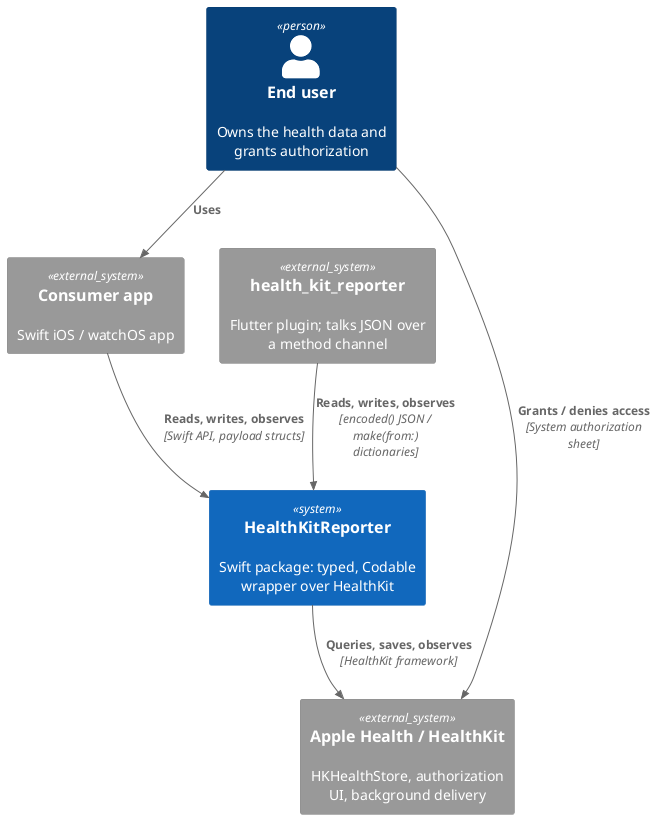

# 3. Context and Scope

## 3.1 Business Context

| Partner | Input to HealthKitReporter | Output from HealthKitReporter |
| :--- | :--- | :--- |
| Consumer app (Swift) | Library types (`QuantityType`, `Quantity`, ...), predicates, callbacks | Payload structs, `HealthKitError`, built `Query` objects |
| Flutter plugin | Type identifiers as strings, payload dictionaries (`[String: Any]`) | Payload JSON strings (`encoded()`) |
| HealthKit | `HK*` samples, statistics, query results, authorization status | `HK*` queries, samples to save/delete, authorization requests |
| End user | Authorization decisions (via the system sheet) | — |

## 3.2 Technical Context

| Channel | Technology | Notes |
| :--- | :--- | :--- |
| Library ⇄ consumer | Swift function calls returning `QueryHandle`s, completion closures (typealiases in `HealthKitReporter.swift`); only library and Foundation types cross this boundary (ADR 0005) | Callbacks arrive on HealthKit's background queues; consumers hop to the main queue themselves. |
| Library ⇄ Flutter plugin | JSON strings and `[String: Any]` dictionaries | Non-finite numbers are encoded as `"Infinity"`, `"-Infinity"`, `"NaN"`. |
| Library ⇄ HealthKit | `HKHealthStore`, `HKQuery` subclasses, `HKAttachmentStore`, builders | One `HKHealthStore` per `HealthKitReporter` instance. |

## 3.3 Scope

**In scope:** mapping of HealthKit object, sample and characteristic types; reading, writing, observing and deleting
data already in Health; authorization; statistics; series; attachments; workout reports and builder-based saving.

**Out of scope (ADR 0003):** live workout sessions (`HKWorkoutSession`, `HKLiveWorkoutBuilder`, mirroring),
async/await API variants, any persistence, sync or network layer.
