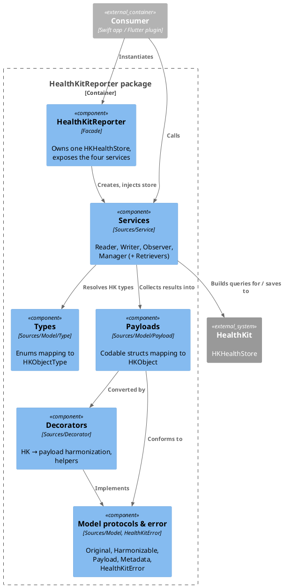

# 5. Building Block View

## 5.1 Level 1 — Whitebox HealthKitReporter

| Building block | Responsibility | Location |
| :--- | :--- | :--- |
| **HealthKitReporter** (facade) | Entry point; creates one `HKHealthStore` per instance and injects it into all services. Declares the public query/callback typealiases. | `Sources/HealthKitReporter.swift` |
| **Services** | The only layer that touches `HKHealthStore` and builds/executes HealthKit queries. | `Sources/Service/` |
| **Types** | Library enums naming HealthKit object types; map to `HKObjectType` and back. | `Sources/Model/Type/` |
| **Payloads** | Value types mirroring HealthKit objects; `Codable`, dictionary-constructible, convertible back to `HK*`. | `Sources/Model/Payload/` |
| **Decorators** | Extensions on `HK*` and Foundation types: harmonization, unit/identifier lookup, enum descriptions, encoding. | `Sources/Decorator/` |
| **Model protocols & error** | `Original`, `Harmonizable`, `Payload`, `UnitConvertable`, `Metadata`, `HealthKitError`. | `Sources/Model/*.swift`, `Sources/HealthKitError.swift` |

**Dependency direction:** Facade → Services → (Types, Payloads) → Decorators → Model protocols / HealthKit.
Payloads and types never reference services; decorators never run queries.

## 5.2 Level 2 — Services

| Service | Responsibility | Files |
| :--- | :--- | :--- |
| `HealthKitReader` | Builds read queries and maps results into payloads. Split into per-family extensions. | `HealthKitReader.swift`, `+ActivitySummary`, `+Anchored`, `+Correlation`, `+HealthRecords`, `+Medications`, `+Series`, `+Statistics`, `+Wellbeing`, `+Workouts` |
| `HealthKitWriter` | Converts payloads to `HK*` and saves/deletes; builder-based workout save; series builders; workout effort relations. | `HealthKitWriter.swift`, `+Series`, `+Workouts` |
| `HealthKitObserver` | Builds observer queries (per type or per `QueryDescriptor` list); enables/disables background delivery. | `HealthKitObserver.swift` |
| `HealthKitManager` | Authorization and its request status, `executeQuery` / `stopQuery`, preferred units, watch app start, earliest permitted sample date, estimate recalibration, attachments. | `HealthKitManager.swift`, `+Attachments` |
| Retrievers | Multi-step queries that fan out per sample and join results. | `Retriever/ElectrocardiogramRetriever.swift`, `Retriever/SeriesSampleRetriever.swift`, `Retriever/SampleResultsCollector.swift` |

Each service is a `public class` holding a single `private let healthStore: HKHealthStore` received through an
`internal init(healthStore:)`, so consumers cannot construct a service against a different store.

## 5.3 Level 2 — Types

| Block | Content |
| :--- | :--- |
| `ObjectType` / `SampleType` protocols | `original: HKObjectType?`, `identifier`, `make(from:)` lookup by identifier. |
| Sample types (`Type/Sample/`) | `QuantityType` (~240 cases), `CategoryType` (~140), `CorrelationType`, `WorkoutType`, `SeriesType`, `ElectrocardiogramType`, `AudiogramType`, `ClinicalType`, `DocumentType`, `VisionPrescriptionType`, `StateOfMindType`, `ScoredAssessmentType`. |
| Non-sample types | `CharacteristicType`, `ActivitySummaryType`, `MedicationType`. |
| Identifier registry | One identifier → `ObjectType` dictionary built from every family's `allCases`, behind `String.objectType` (ADR 0001). |

## 5.4 Level 2 — Payloads

Every payload follows the same shape (reference: `Quantity.swift`):

1. nested `Harmonized: Codable` for the value part (value, unit, metadata);
2. `public let` fields — `uuid`, `identifier`, `startTimestamp`, `endTimestamp`, `device`, `sourceRevision`, `harmonized`;
3. `internal init(<hk>:) throws` from the HealthKit object;
4. public memberwise `init` and `copyWith(...)`;
5. extensions `Original` (`asOriginal()`), `Payload` (`make(from:)`, `collect(from:)`) and `Factory` (`collect(results:)`).

Families: samples (`Quantity`, `Category`, `Correlation`, `Workout`, `WorkoutRoute`, `HeartbeatSeries`,
`Electrocardiogram`, `Audiogram`, `StateOfMind`, `ScoredAssessment`, `VisionPrescription`, `MedicationDoseEvent`,
`ClinicalRecord`, `VerifiableClinicalRecord`, `CDADocument`), aggregates (`Statistics`, `ActivitySummary`,
`QuantitySeriesValue`), supporting values (`Device`, `Source`, `SourceRevision`, `WorkoutActivity`,
`WorkoutConfiguration`, `WorkoutEvent`, `WorkoutEffortRelationship`, `Attachment`, `Characteristic`,
`UserAnnotatedMedication`, `DeletedObject`) and the type-erased `Sample` protocol.

## 5.5 Level 2 — Decorators

| Group | Examples |
| :--- | :--- |
| Harmonization of HK samples | `Extensions+HKQuantitiySample`, `+HKCategorySample`, `+HKWorkout`, `+HKElectrocardiogram`, `+HKStatistics`, `+HKActivitySummary` |
| Type and unit lookup | `+HKQuantityType` (`siUnit`, `compatibleUnit(from:)`), `+HKCategoryType`, `+HKUnit`, `+String` (`objectType`) |
| Enum descriptions | `+HKCategoryValue*`, `+HKWorkoutActivityType`, `+HKBloodType`, `+HKBiologicalSex`, ... (unknown cases are described, not crashed on) |
| Foundation helpers | `+Date`, `+Double` (`asDate`), `+Dictionary`, `+DateComponents`, `+Encodable` (`encoded()`) |
