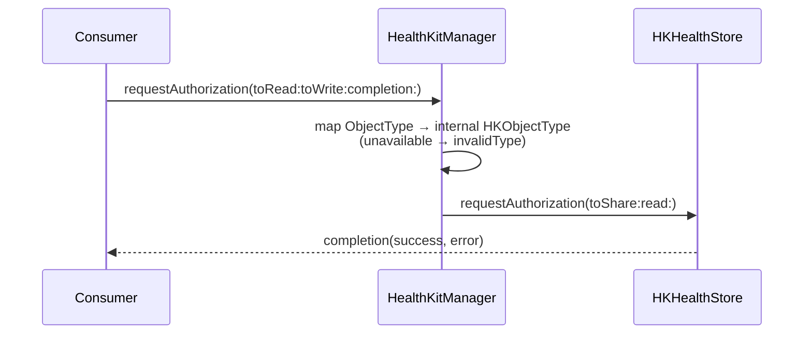
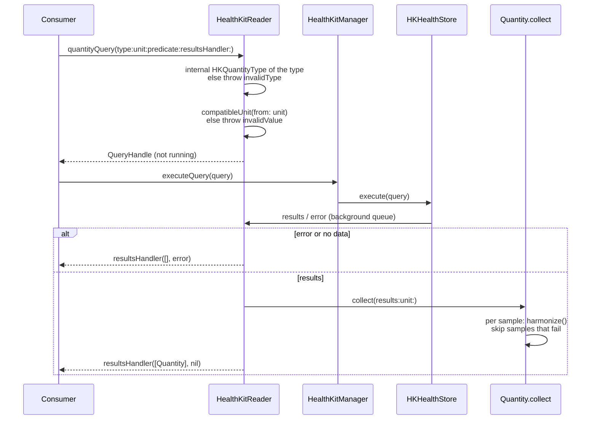
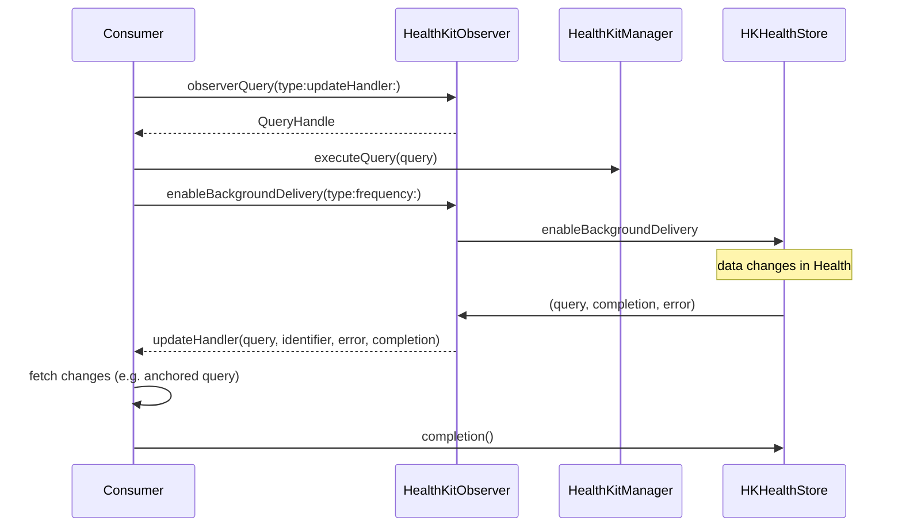
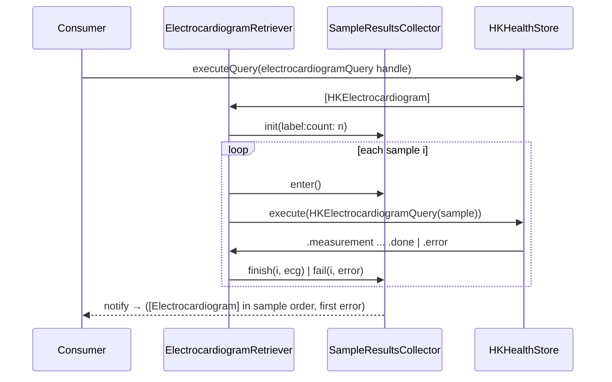
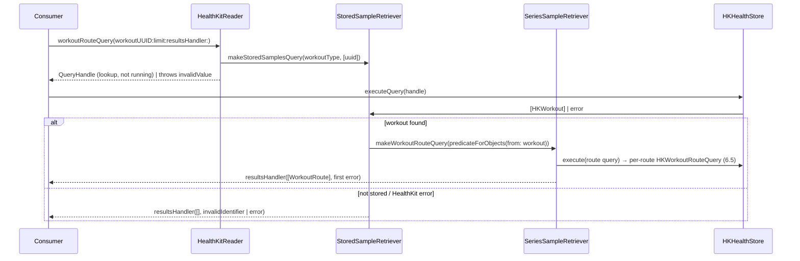

# 6. Runtime View

## 6.1 Authorization

HealthKit never reveals whether *read* access was granted; `authorizationRequestStatus` only tells whether the sheet
would be shown. `HealthKitWriter.isAuthorizedToWrite(type:)` reports write access.

## 6.2 Read — build, then execute

The same shape applies to category, workout, correlation, statistics, anchored and series queries. Input errors
throw synchronously at build time; HealthKit errors arrive in the handler. Anchored queries return an `Anchor`
(a `Codable` wrapper of the archived `HKQueryAnchor`) that the consumer passes to the next run.

## 6.3 Write

1. The consumer builds a payload (memberwise `init` or `make(from:)` from a Flutter dictionary).
2. `HealthKitWriter.save(sample:)` / `addQuantity(...)` calls `asOriginal()`, which resolves the identifier, parses the
   unit and metadata, and throws `HealthKitError.invalidType` / `invalidValue` on bad input.
3. The resulting `HKSample` is saved to the store; `StatusCompletionBlock(success, error)` is always called.

Workouts (ADR 0003) use `saveWorkout(_:samples:route:completion:)`: `HKWorkoutBuilder` begins collection, adds
samples, ends collection, finishes the workout, then an `HKWorkoutRouteBuilder` attaches the route; the handler
receives the saved `Workout` payload.

## 6.4 Observe and background delivery

The `ObserverCompletionUpdateHandler` variant hands HealthKit's completion to the consumer, who must call it after
processing — also on the error path — or HealthKit throttles background delivery. The plain `ObserverUpdateHandler`
variant calls it immediately after the handler returns.

## 6.5 Multi-step retrieval (ECG with voltages)

`SampleResultsCollector` serializes writes from concurrent HealthKit callbacks on a private queue, keeps results in
sample order and reports the first failure. Heartbeat series and workout routes use the same collector via
`SeriesSampleRetriever`.

## 6.6 Chained lookup (routes of one workout)

The handle wraps the lookup only; `stopQuery` before the workout is found stops the chain, afterwards the route
queries run to the end (ADR 0006).
