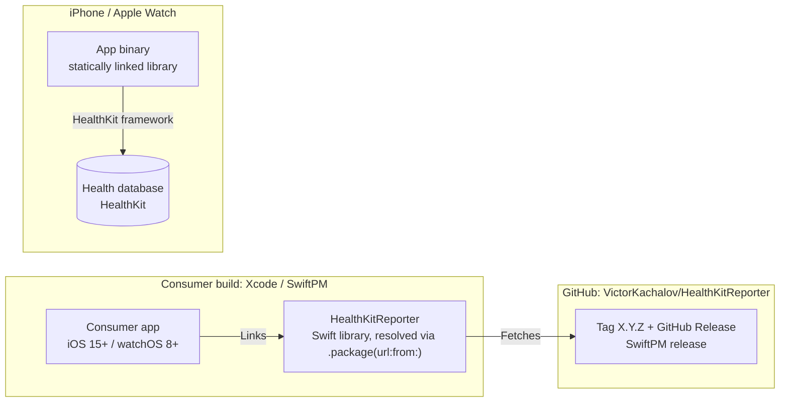

# 7. Deployment View

## 7.1 Distribution

- The package ships as source and is compiled into the consumer app; there is no binary framework and no runtime
  dependency besides HealthKit.
- Consumer apps need the HealthKit capability, `NSHealthShareUsageDescription` / `NSHealthUpdateUsageDescription`, and,
  for background delivery, the background-delivery entitlement.
- CocoaPods `3.1.0` remains installable but receives no further releases.

## 7.2 CI (`.github/workflows/ci.yml`)

| Job | Runner | Checks |
| :--- | :--- | :--- |
| `lint` | ubuntu, SwiftLint container | `swiftlint lint --strict` |
| `release-guard` | ubuntu | Top `CHANGELOG.md` entry matches `.release-please-manifest.json` |
| `package` | macOS | manifest validation, iOS simulator tests with coverage, coverage ≥ `COVERAGE_THRESHOLD`, watchOS build |
| `example` | macOS | Builds the `HealthKitReporter_Example` iOS app and the `HealthKitReporterWatch` watch companion from `Example/HealthKitReporter.xcodeproj` |

## 7.3 Release (`.github/workflows/release.yml`)

release-please reads Conventional Commits on `master`, keeps a `chore: release X.Y.Z` PR open (manifest bump,
`CHANGELOG.md` entry reformatted to `## [X.Y.Z] - dd.MM.yyyy.`, README version line), and on merge creates the bare
`X.Y.Z` tag and GitHub Release that SwiftPM resolves.

## 7.4 Example app

`Example/` is a programmatic UIKit demo (MVVM with Combine) that consumes the repo root as a local Swift package:
`DemoViewController` binds `DemoView` to `DemoViewModel`, whose `Input`/`Output` subjects carry tapped rows and
per-row results, and `HealthKitReporterService` runs each of the ~70 demo rows through one `DemoPerformer` per
library area. A SwiftUI watch companion (`HealthKitReporterWatch`) handles `startWatchApp`. On a fresh simulator the
app authorizes and seeds a week of data for every writable type; clinical records are authorized separately because
Health's records flow needs an Apple Account. It is the verification path for store-dependent behavior and for the
HK → payload mapping, which unit tests cannot reach.
